# 🚀 Peblo AI Notes App

A full-stack AI-powered notes application that allows users to create, manage, and enhance notes using AI assistance.  
Built with the MERN stack and modern authentication system.

---

## ✨ Features

- 🔐 Secure Authentication (Signup / Login with JWT)
- 🧠 AI-powered note assistance
- 📝 Create, edit, delete notes
- 📂 Archive notes system
- 🕘 Notes history tracking
- 🔎 Search & organize notes efficiently
- 🌐 Full-stack MERN architecture
- 📱 Fully responsive UI (Mobile + Desktop)

---

## 🛠️ Tech Stack

### 🎨 Frontend
- React.js (Vite)
- CSS3
- Axios

### ⚙️ Backend
- Node.js
- Express.js
- MongoDB
- JWT Authentication
- REST APIs

### 🧠 AI Integration
- Google Gemini API / OpenAI API (if used in project)

---

### 🚀 Future Improvements
🎙️ Voice-to-text note creation
🧠 Better AI summarization
☁️ Cloud deployment (Vercel / Render)
🤝 Real-time collaboration features
📱 Mobile app version

---

## ⚙️ Installation & Setup Guide


    Clone Repository

    ```bash
    git clone https://github.com/SoujanyaCL/peblo-ai-notes.git
    cd peblo-ai-notes

    📦 1. Install Dependencies

    🔹 Frontend  
    cd client
    npm install

    🔹 Backend
    cd server
    npm install

    🔐 2. Environment Variables Setup

    DATABASE_URL=
    JWT_SECRET=
    LLM_API_KEY=

    🚀 3. Run the Application

    🔹 Start Backend
    cd server
    npm start

    🔹 Start Frontend
    cd client
    npm run dev

    🧪 4. How to Test the Application

    After running both servers:

    Open browser → Frontend URL (usually http://localhost:5173 or 3000)
    🌐 1. Open the Application
    👤 2. User Authentication
    📝 3. Notes Functionality (CRUD)
    🧠 4. AI Summarization Feature
    🔍 5. Search & Filter
    🔗 6. Public Sharing (If Implemented)
    📊 7. Dashboard / Insights (If Available)
    ✅ Expected Outcome


## 🖼️ Screenshots

### 🔐 Login Page
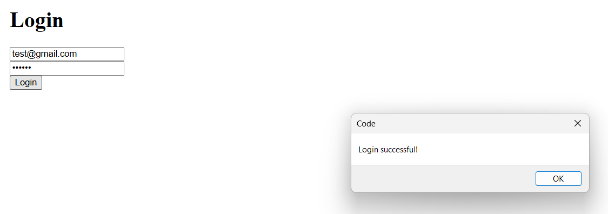

### 🏠 Home Page
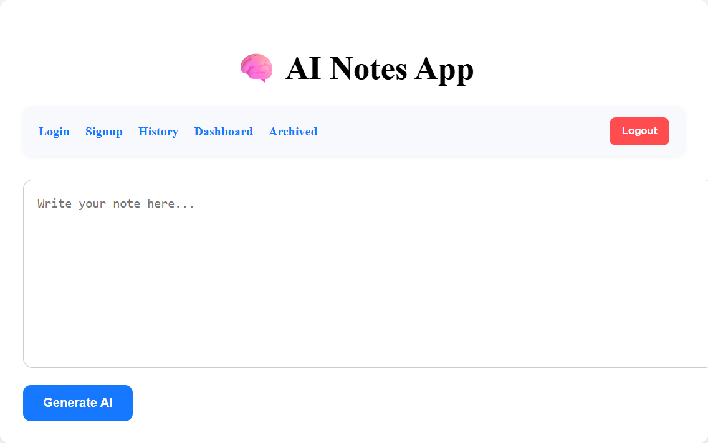

### 📊 Dashboard View
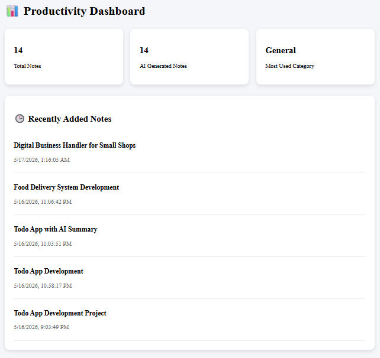

### 📝 Notes Page
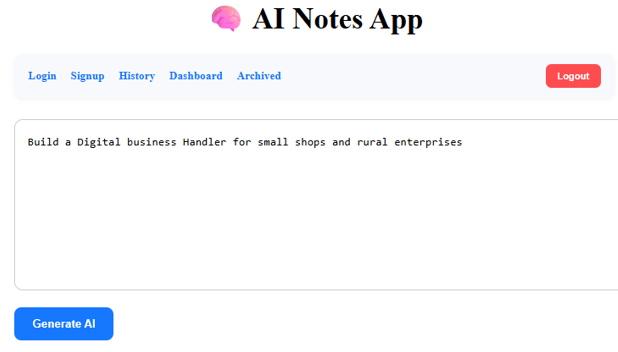

### 🧠 AI Summary
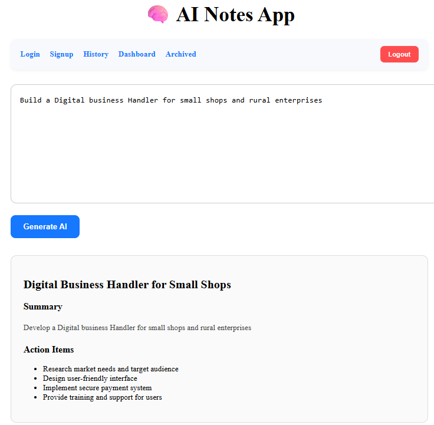

### 🔍 Search Feature
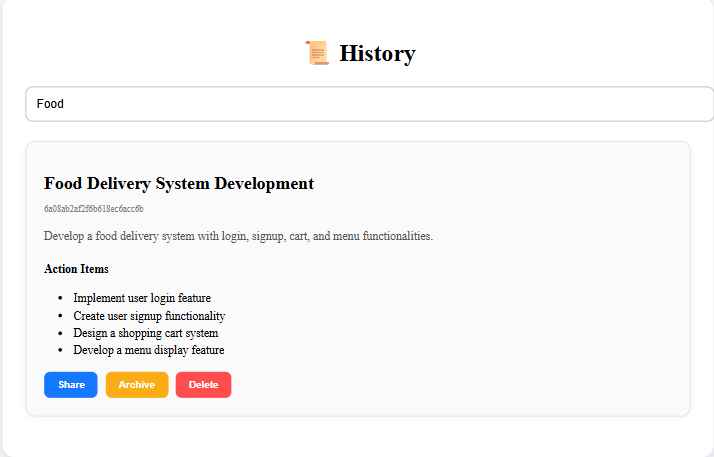

### 🔗 Share Link
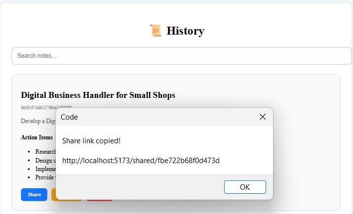

### 🌐 Public Note View
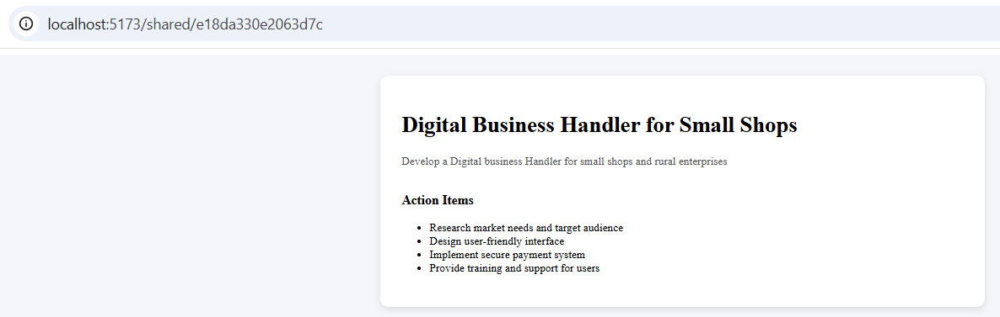

### 📜 History Page
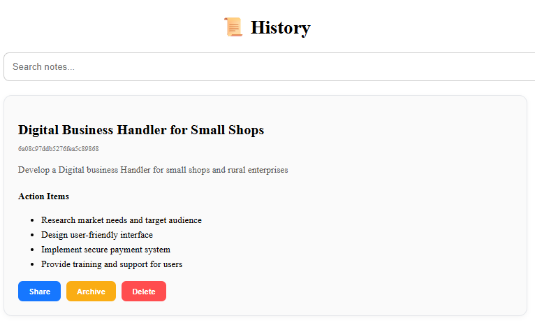

### 📦 Archived Notes
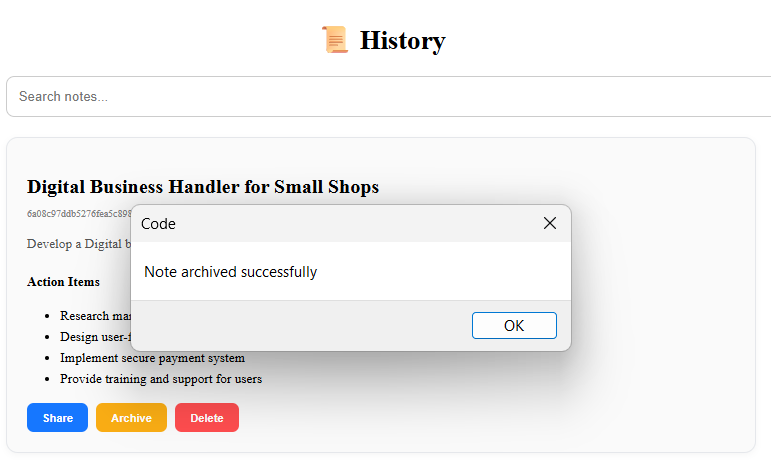

### 🔄 Restore Feature
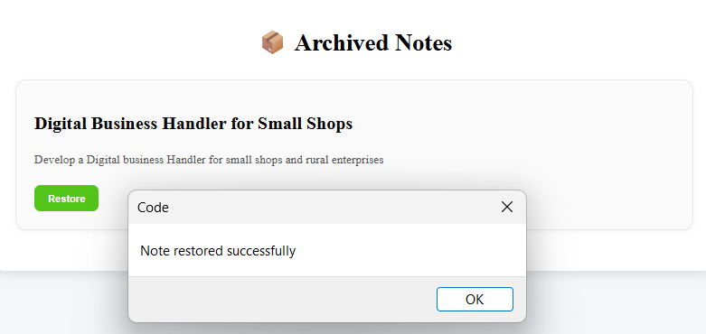

### 🗑️ Delete Note
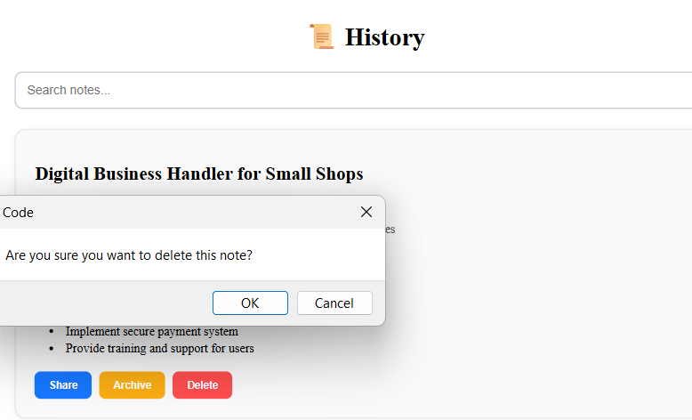